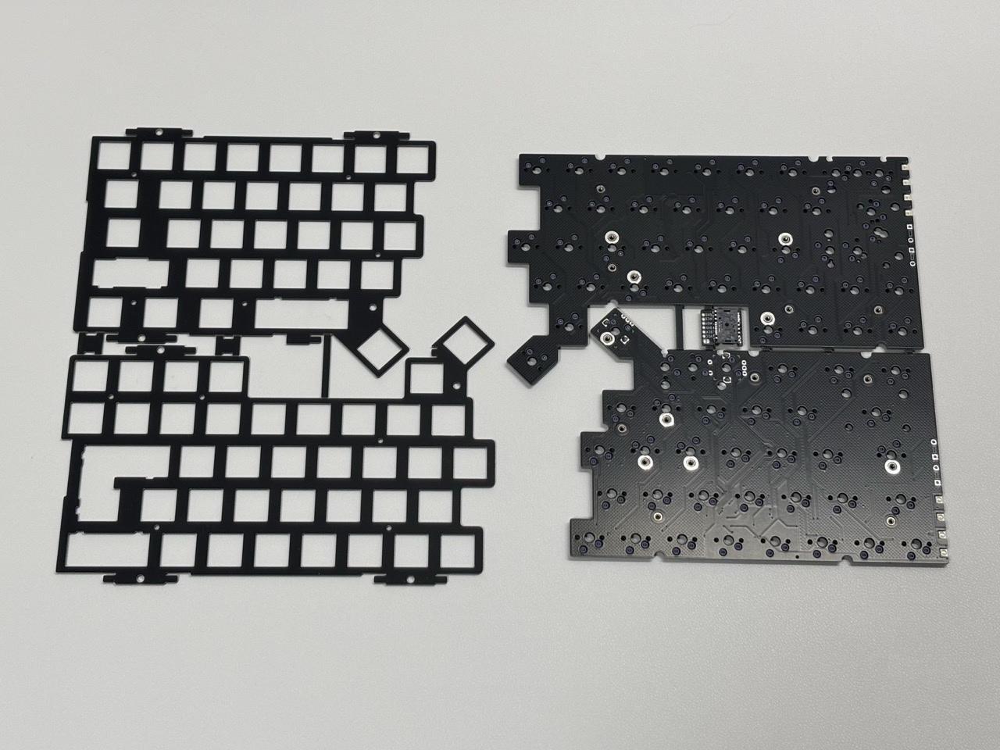

import { Image } from "astro:assets";
import topPlateSeparated from "./img/assembly/1_1_top_plate_separated.jpeg";
import circuitBoardSeparated from "./img/assembly/1_2_circuit_board_separated.jpeg";

基板の切り離しから始めて、ケースへの取り付けと動作確認を行います。

## 注意点

- **FFC ケーブルの取り扱い**: FFC ケーブルは乱雑に取り扱うと容易に断線します
- **XIAO の取り付け**: コンスルーを使った XIAO の取り付けは無理に力を加えるとコンスルーが破損する可能性があります
- **タッチセンサーの取り付け**: タッチセンサー端子は乱雑に取り扱うと断線する可能性があります

## 1. 基板の切り離し

回路基板とトッププレート基板を切り離します。

### 1.1 トッププレート基板の分離

<Image src={topPlateSeparated} alt="トッププレート基板の分離後" width={640} />

### 1.2 回路基板の分離

<Image src={circuitBoardSeparated} alt="回路基板の分離後" width={640} />

## 2. ボトムケースの組み立て

import bottomCaseOverview from "./img/assembly/2_bottom_case_overview.jpeg";

以下の写真のものと FFC ケーブルを用意します。

- ネジパック A
- ボトムケース
- 電池ケースx2
- 制御基板x2
- XIAO 固定用カバーx2
- 電源スイッチカバーx2
- リセットボタンx1(右側用)
- XIAO nrf52840 plus x2（ファームウェア書き込み済み）

<Image src={bottomCaseOverview} alt="ボトムケースと部品一覧" width={640} />

### 2.1 電池ケースの取り付け

import batteryCase from "./img/assembly/2_1_battery_case.jpeg";
import batteryCaseScrewed from "./img/assembly/2_1_battery_case_screwed.jpeg";

電池ケースをボトムケースにはめ込み、左右ともに M2 5mm のねじ（短い方） でねじ止めします。

<Image src={batteryCase} alt="電池ケースのねじ止め" width={480} />

<Image src={batteryCaseScrewed} alt="電池ケース取り付け後" width={480} />

### 2.2 XIAO 基板の組み立て

import xiaoBoardAndCover from "./img/assembly/2_2_1_xiao_board_and_cover.jpeg";
import xiaoAttached from "./img/assembly/2_2_1_xiao_attached.jpeg";
import xiaoAttachedBoth from "./img/assembly/2_2_1_xiao_attached_both.jpeg";
import powerSw from "./img/assembly/2_2_2_power_sw.jpeg";
import powerSwSide from "./img/assembly/2_2_2_power_sw_side.jpeg";
import powerSwBoth from "./img/assembly/2_2_2_power_sw_both.jpeg";
import ffcCables from "./img/assembly/2_2_3_ffc_cables.jpeg";
import ffcRight from "./img/assembly/2_2_3_ffc_right.jpeg";
import ffcLeft from "./img/assembly/2_2_3_ffc_left.jpeg";

1. XIAO をコンスルーの間にはめ込みます。向きはXIAOの裏側が見えるように、USB コネクタが下側になるようにしてください。

   <Image src={xiaoBoardAndCover} alt="制御基板とカバー" width={480} />

1. カバーを上から被せます。コンスルーのピンがカバーの隙間部分にしっかりと入っていることを確認しながら少し力を入れて押し込んでください。ずれたまま無理に押し込むとコンスルーが破損する可能性があるので注意してください。この時点ではカバーが浮いてきていても問題ありません。

   <Image src={xiaoAttached} alt="XIAO の取り付け" width={480} />

1. 左右両方にカバーを取り付けます

   <Image src={xiaoAttachedBoth} alt="カバーの取り付け" width={480} />

1. 電源スイッチカバーを取り付けます。スイッチカバーには方向があります。よく見ると内部の切り欠きが片側に寄っているので、スペースが大きい方が基板側になるように取り付けてください。

   <Image src={powerSw} alt="電源スイッチカバーの取り付け" width={480} />

   <Image src={powerSwSide} alt="電源スイッチカバーの側面" width={480} />

1. 左右両方に電源スイッチカバーを取り付けます

   <Image
     src={powerSwBoth}
     alt="電源スイッチカバーの両側取り付け"
     width={480}
   />

1. 制御基板に２種類の FFC ケーブルを取り付けます。右側の基板には 24pin, 6pin の両方を、左側の基板には 24pin のみを取り付けます。取り付ける際は、コネクタの黒いロックを縦にして、FFC ケーブルの金属端子が基板側に来るようにしてください。FFC ケーブルをコネクタに差し込んだ後、ロックを横に倒して固定します。画像は固定後の状態です。

   <Image src={ffcCables} alt="FFC ケーブルの取り付け" width={640} />

   <Image src={ffcRight} alt="右側のFFC ケーブルの取り付け" width={480} />
   <Image src={ffcLeft} alt="左側のFFC ケーブルの取り付け" width={480} />

### 2.3 基板のボトムケースへの取り付け（右）

import resetButton from "./img/assembly/2_2_4_reset_button.jpeg";
import resetButtonAttaching from "./img/assembly/2_2_4_reset_attaching.jpeg";
import resetButtonAttached from "./img/assembly/2_2_4_reset_attached.jpeg";
import mountRightBattery from "./img/assembly/2_2_5_mount_right_battery.jpeg";
import mountRight from "./img/assembly/2_2_5_mount_right.jpeg";
import mountRightScrew from "./img/assembly/2_2_5_mount_right_screw.jpeg";
import mountRightScrew2 from "./img/assembly/2_2_5_mount_right_screw2.jpeg";

1. 右側のボトムケースにリセットボタンを取り付けます。太い側をボトムケースに差し込みます。

   <Image src={resetButton} alt="リセットボタンの取り付け" width={480} />
   <Image
     src={resetButtonAttaching}
     alt="リセットボタンの取り付け中"
     width={480}
   />
   <Image
     src={resetButtonAttached}
     alt="リセットボタン取り付け後"
     width={480}
   />

1. 右側の制御基板に電池ケースのケーブルを接続します。

   <Image src={mountRightBattery} alt="右側基板の取り付け" width={480} />

1. 右側の制御基板をボトムケースに入れます。USB端子と電源スイッチが引っかからないように少し斜めから入れてください。力を入れなくても入るようになっています。力を入れてしまうと電源スイッチが破損する可能性があります。先ほど取り付けたリセットスイッチにも少し注意を払ってください。ずれた状態で押し込むとリセットスイッチが簡単に折れてしまいます。

   <Image src={mountRight} alt="右側基板の取り付け2" width={480} />

1. 右側のXIAOカバー部分を M2 9mm のねじ（長い方） 3本でねじ止めします。

   <Image src={mountRightScrew} alt="右側基板のねじ止め" width={480} />

1. 右側の残りの２つの穴を M2 5mm のねじ（短い方） 2本でねじ止めします。

   <Image src={mountRightScrew2} alt="右側基板のねじ止め2" width={480} />

### 2.4 基板のボトムケースへの取り付け（左）

import mountLeft from "./img/assembly/2_2_6_mount_left.jpeg";
import mountLeftBattery from "./img/assembly/2_2_6_mount_left_battery.jpeg";
import mountingLeft from "./img/assembly/2_2_6_mounting_left.jpeg";
import mountingLeft2 from "./img/assembly/2_2_6_mounting_left2.jpeg";
import mountLeftScrew from "./img/assembly/2_2_6_mount_left_screw.jpeg";
import mountLeftScrew2 from "./img/assembly/2_2_6_mount_left_screw2.jpeg";
import mountLeftScrew3 from "./img/assembly/2_2_6_mount_left_screw3.jpeg";

1. 左側の制御基板を取り付けます。左は裏表が逆になります。

   <Image src={mountLeft} alt="左側基板の取り付け" width={480} />

1. 左側の制御基板に電池ケースのケーブルを接続します。

   <Image src={mountLeftBattery} alt="左側基板の電池接続" width={480} />

1. 左側の制御基板をボトムケースに入れます。USB端子と電源スイッチが引っかからないように少し斜めから入れてください。こちらは右よりも余裕が少なくなっています。基板が押し返してきて入れづらいですが、ある程度力を入れつつも注意深く入れてください。

   <Image src={mountingLeft} alt="左側基板の取り付け" width={480} />
   <Image src={mountingLeft2} alt="左側基板の取り付け2" width={480} />

1. ねじはまず真ん中の穴から止めます。M2 9mm のねじ（長い方） 1本にナイロンワッシャーを取り付けてねじ止めします。強く締めすぎるとケースの裏側に盛り上がりができてしまうことがあるのでしっかり固定しつつも締めすぎに注意してください。なお、ナイロンワッシャーをつけ忘れると基板に傷がつきますが、特に問題はありません。

   <Image src={mountLeftScrew} alt="左側基板のねじ止め" width={480} />

1. XIAO カバー部分の残りの穴を M2 9mm のねじ（長い方） 2本とナイロンワッシャーでねじ止めします。

   <Image src={mountLeftScrew2} alt="左側基板のねじ止め2" width={480} />

1. 左側の基板の残りの穴を M2 5mm のねじ（短い方） 2本でねじ止めします。

   <Image src={mountLeftScrew3} alt="左側基板のねじ止め3" width={480} />

## 3. エンブレムプレートの取り付け

import emblemPlateParts from "./img/assembly/3_emblem_plate.jpeg";
import emblemPlateAttached from "./img/assembly/3_emblem_plate_attached.jpeg";
import emblemPlateBottom1 from "./img/assembly/3_emblem_plate_bottom1.jpeg";
import emblemPlateBottom2 from "./img/assembly/3_emblem_plate_bottom2.jpeg";
import emblemPlateBottom3 from "./img/assembly/3_emblem_plate_bottom3.jpeg";

以下の画像の部品を用意します。画像では、右側は同梱の3Dプリント製のプレートの代わりに特注の真鍮製のプレートを使用しています。
真鍮製のプレートにご興味がある場合はご自分で発注していただくことが可能です。

- ネジパック B
- ボトムエンブレム x2
- ボトムケース

<Image src={emblemPlateParts} alt="エンブレムプレートの取り付け" width={640} />

エンブレムプレートをはめ込み、M2 4mm のねじ（黒色）x4 でねじ止めします。ネジが短いのでネジ穴が潰れやすくなっています。締めすぎないように注意してください。ガタガタしない程度に止まっていれば問題ありません。

<Image
  src={emblemPlateAttached}
  alt="エンブレムプレート取り付け後"
  width={640}
/>

エンブレムプレートを取り付けた後のボトムケースの状態は以下のようになります。

<Image
  src={emblemPlateBottom1}
  alt="エンブレムプレート取り付け後の底面1"
  width={480}
/>

なお、真鍮製プレートを JLCPCB で鏡面加工してみたものは以下のような仕上がりになりました。
個人的には鏡面加工なしの方が好みです。鏡面加工する場合はより細かい Roughness を選択した方が良さそうです。

<Image
  src={emblemPlateBottom2}
  alt="エンブレムプレート取り付け後の底面2"
  width={480}
/>
<Image
  src={emblemPlateBottom3}
  alt="エンブレムプレート取り付け後の底面3"
  width={480}
/>

## 4. トラックボール基板の取り付け

import trackballParts from "./img/assembly/4_trackball_parts.jpeg";
import trackballLens from "./img/assembly/4_trackball_lens.jpeg";
import trackballLens2 from "./img/assembly/4_trackball_lens2.jpeg";
import trackballFfc from "./img/assembly/4_trackball_ffc.jpeg";
import trackballCase from "./img/assembly/4_trackball_case.jpeg";
import trackballCase2 from "./img/assembly/4_trackball_case2.jpeg";
import trackballCase3 from "./img/assembly/4_trackball_case3.jpeg";
import trackballCase4 from "./img/assembly/4_trackball_case4.jpeg";
import trackballMounted from "./img/assembly/4_trackball_mounted.jpeg";
import trackballScrew from "./img/assembly/4_trackball_screw.jpeg";
import trackballScrew2 from "./img/assembly/4_trackball_screw2.jpeg";
import trackballFinal from "./img/assembly/4_trackball_final.jpeg";

以下の画像の部品と先ほど使用したネジパックBを用意します。

<Image src={trackballParts} alt="トラックボール部品" width={480} />

1. トラックボールセンサーについている茶色の保護シートを剥がします。剥がすとセンサーの穴がむき出しになります。上の画像は剥がした状態です。

1. トラックボールセンサー基板にレンズを取り付けます。レンズの突起がセンサーの穴に入るようにしてください。突起は裏側に突き出ます。ハンダゴテがある場合は画像のように突起部分に熱を加えて溶かして固定します。ニッパーで切断するだけでも問題ありません。

<Image src={trackballLens} alt="トラックボールレンズ" width={480} />
<Image src={trackballLens2} alt="トラックボールレンズ2" width={480} />

1. トラックボールセンサー基板にボトムケースに取り付けた 6pin FFCケーブルを接続します。コネクタの黒いロックを縦にして、FFC ケーブルの金属端子が基板側に来るようにしてください。FFC ケーブルをコネクタに差し込んだ後、ロックを横に倒して固定します。

<Image src={trackballFfc} alt="トラックボールFFC接続" width={480} />

1. トラックボールケースにトラックボールセンサー基板を入れます。以下の画像のようにFFCケーブルをうまく折り曲げて端子に負荷がかからないようにして差し込んでください。FFC ケーブルは強く曲げると断線する可能性があるので注意してください。

   <Image src={trackballCase} alt="トラックボールケース" width={480} />
   <Image src={trackballCase2} alt="トラックボールケース2" width={480} />
   <Image src={trackballCase3} alt="トラックボールケース3" width={480} />

1. 奥まで差し込んだらカバーを取り付けます

   <Image src={trackballCase4} alt="トラックボールケース4" width={480} />

1. ボトムケースに乗せて裏返します

   <Image src={trackballMounted} alt="トラックボール取り付け後" width={480} />

1. M2 4mm のねじ（黒色） 3本でねじ止めします。あとで位置を調整できるので、ここでは軽く止める程度で大丈夫です。完成後にもう少ししっかり止めることをおすすめします。

   <Image src={trackballScrew} alt="トラックボールのねじ止め" width={480} />
   <Image src={trackballScrew2} alt="トラックボールのねじ止め2" width={480} />

1. 最後に FFC ケーブルの位置を調整します

<Image src={trackballFinal} alt="トラックボール取り付け後" width={480} />

## 5. キースイッチ基板の組み立て

import keyswitchOverview from "./img/assembly/5_keyswitch.jpeg";
import keyswitchTadpole from "./img/assembly/5_1_tadpole1.jpeg";
import keyswitchTadpole2 from "./img/assembly/5_1_tadpole2.jpeg";
import keyswitchSettingSwitch from "./img/assembly/5_2_setting_switch.jpeg";
import keyswitchSettingSwitch2 from "./img/assembly/5_2_setting_switch2.jpeg";
import keyswitchSettingSwitchBoth from "./img/assembly/5_2_setting_switch_both.jpeg";
import keyswitchStabilizer from "./img/assembly/5_3_stabilizer_en.jpeg";
import keyswitchPre from "./img/assembly/5_4_keyswitch_pre.jpeg";
import keyswitchPre2 from "./img/assembly/5_4_keyswitch_pre2.jpeg";
import keyswitchPreBoth from "./img/assembly/5_4_keyswitch_pre_both.jpeg";
import touchSensor from "./img/assembly/5_5_touch_sensor.jpeg";
import touchSensorTape from "./img/assembly/5_5_touch_sensor_tape.jpeg";
import touchSensorTape2 from "./img/assembly/5_5_touch_sensor_tape2.jpeg";
import touchSensorScrew from "./img/assembly/5_5_touch_sensor_screw.jpeg";
import touchSensorAll from "./img/assembly/5_5_touch_sensor_all.jpeg";
import keyswitchClick from "./img/assembly/5_6_keyswitch_click.jpeg";
import keyswitchClick2 from "./img/assembly/5_6_keyswitch_click2.jpeg";
import keyswitchLeft from "./img/assembly/5_6_keyswitch_left1.jpeg";
import keyswitchLeft2 from "./img/assembly/5_6_keyswitch_left2.jpeg";
import keyswitchTouchSensor from "./img/assembly/5_6_keyswitch_touchsensor.jpeg";
import keyswitchTouchSensor2 from "./img/assembly/5_6_keyswitch_touchsensor2.jpeg";
import keyswitchFinal from "./img/assembly/5_final.jpeg";

以下の部品を用意します

<Image src={keyswitchOverview} alt="キースイッチの部品一覧" width={640} />

### 5.1 Tadpole ピンの取り付け

Tadpole を写真のようにトッププレートに裏側から差し込みます。
２つ目の画像は左側を裏返した状態です。

<Image src={keyswitchTadpole} alt="Tadpole ピンの取り付け" width={480} />
<Image src={keyswitchTadpole2} alt="Tadpole ピンの取り付け2" width={480} />

### 5.2 設定スイッチの取り付け

設定スイッチを左右２つずつキースイッチ基板に差し込みます。半田付けしない場合はピンのバネの力で導通した状態になります。はんだごてをお持ちの場合ははんだ付け推奨です。

<Image src={keyswitchSettingSwitch} alt="設定スイッチの取り付け" width={480} />
<Image
  src={keyswitchSettingSwitch2}
  alt="設定スイッチの取り付け2"
  width={480}
/>
<Image
  src={keyswitchSettingSwitchBoth}
  alt="設定スイッチの取り付け両方"
  width={480}
/>

### 5.3 スタビライザーの取り付け

キースイッチ基板にスタビライザーを取り付けます。下の画像は英語配列向けの配置になっています。日本語配列の場合は右上と左内側が不要で、右真ん中のスタビライザーはエンターキーに合わせた縦向きの配置になります。
スタビライザーにルブを塗る場合はこのタイミングで塗ってください。

<Image src={keyswitchStabilizer} alt="スタビライザーの取り付け" width={480} />

### 5.4 キースイッチの仮止め

トッププレートの４隅にキースイッチはめ込んでキースイッチ基板にキースイッチを差し込みます。
以下の画像では左親指にスイッチを取り付けてしまっていますが、次のステップで親指の位置にタッチセンサーを取り付けるので一つ上か隣に取り付けてください。
右も同様に仮止めします。

<Image src={keyswitchPre} alt="キースイッチの仮止め" width={480} />
<Image src={keyswitchPre2} alt="キースイッチの仮止め2" width={480} />
<Image src={keyswitchPreBoth} alt="キースイッチの仮止め両方" width={480} />

### 5.5 タッチセンサーの取り付け（スキップ可能）

キーキャップの裏側にタッチセンサーを貼り付けて、回路基板にねじ止めします。
タッチセンサーの端子は非常に繊細で、乱雑に取り扱うと断線する可能性があるので注意してください。
このステップは後から行うことも可能です。タッチセンサーは最大８つ設置できますが、現状使い道があまり思い浮かばないキーもあるため最初は必要な部分だけ取り付けてみるのがおすすめです。
以下の画像にあるキーと`V`がタッチセンサーの取り付けに対応しています。（**`F` と `V` はどちらか片方のみ**）

<Image src={touchSensor} alt="タッチセンサーの取り付け" width={480} />

1. タッチセンサーに画像のように両面テープを貼り付けて４方を折り曲げ、キーキャップの内側に貼り付けます。タッチセンサーの面裏はどちらでも問題ありませんが、片側のみが金属になっているので、金属面がキーキャップ側になるように（金属面側と指の距離ができるだけ近づくように）すると気分が良いです。上下の向きは、センサーのねじ止めする部分がキーキャップの上側に来る向きになるようにしてください。

<Image src={touchSensorTape} alt="タッチセンサーの取り付けテープ" width={480} />
<Image
  src={touchSensorTape2}
  alt="タッチセンサーの取り付けテープ2"
  width={480}
/>

1. ネジパック C の M2 3mm のねじを使って画像のようにタッチセンサーをねじ止めします。導通するようにある程度しっかりとねじ止めしてください。

<Image src={touchSensorScrew} alt="タッチセンサーの取り付けねじ" width={480} />
<Image src={touchSensorAll} alt="タッチセンサーの取り付け全体" width={480} />

### 5.6 残りのキースイッチとキーキャップの取り付け

残りすべてのキースイッチとキーキャップを取り付けます

<Image src={keyswitchLeft} alt="キースイッチの取り付け左側" width={480} />

タッチセンサー部分は画像のように接続部がスイッチの上側に挟み込まれるようになります

<Image
  src={keyswitchTouchSensor}
  alt="キースイッチの取り付けタッチセンサー"
  width={480}
/>

<Image
  src={keyswitchTouchSensor2}
  alt="キースイッチの取り付けタッチセンサー2"
  width={480}
/>

タッチセンサーのついたキーキャップはすぐにキースイッチに取り付けます

<Image src={keyswitchLeft2} alt="キースイッチの取り付け左側2" width={480} />

マウスの左クリックとして使うキー（`M`が推奨）はタクタイル型のスピードスイッチを使うのがおすすめです。

<Image src={keyswitchClick} alt="キースイッチの取り付け" width={480} />
<Image src={keyswitchClick2} alt="キースイッチの取り付け2" width={480} />

全て取り付けました

<Image src={keyswitchFinal} alt="キースイッチの最終取り付け" width={480} />

## 6. トップケースの組み立て

import topCaseOverview from "./img/assembly/6_topcase.jpeg";
import topCaseLeftSettingSwitch from "./img/assembly/6_1_left_setting_switch.jpeg";
import topCaseLeftCircuit from "./img/assembly/6_1_left_circuit.jpeg";
import topCaseLeftCircuit2 from "./img/assembly/6_1_left_circuit2.jpeg";
import topCaseLeftFfc from "./img/assembly/6_1_left_ffc.jpeg";
import topCaseLeftFfc2 from "./img/assembly/6_1_left_ffc2.jpeg";
import topCaseLeftMerge from "./img/assembly/6_1_left_merge.jpeg";
import topCaseRightCircuit from "./img/assembly/6_2_right_circuit.jpeg";
import topCaseRightFfc from "./img/assembly/6_2_right_ffc.jpeg";
import topCaseRightMerge from "./img/assembly/6_2_right_merge.jpeg";
import topCaseScrew from "./img/assembly/6_3_screw.jpeg";
import topCaseScrew2 from "./img/assembly/6_3_screw2.jpeg";
import bottomPad from "./img/assembly/6_4_pad.jpeg";
import batteryCover from "./img/assembly/6_5_battery_cover.jpeg";
import batteryCover2 from "./img/assembly/6_5_battery_cover2.jpeg";
import batteryCover3 from "./img/assembly/6_5_battery_cover3.jpeg";

以下の部品とネジパックBの残り、ゴム足、ボトムケースを用意します。

<Image src={topCaseOverview} alt="トップケースの部品一覧" width={640} />

### 6.1 左側のトップケースの組み立て

1. 左側のトップケースを裏返して設定スイッチを取り付けます。向きは、出っ張りが内側になるようにしてください。（正しい向きにしか入らないはずです。）

   <Image
     src={topCaseLeftSettingSwitch}
     alt="トップケース左側の設定スイッチ取り付け"
     width={480}
   />

1. 左側のトップケースに回路基板を入れます。真っ直ぐ入れると LED 部分が干渉するので少し斜めから入れます。

   <Image
     src={topCaseLeftCircuit}
     alt="トップケース左側の回路基板取り付け"
     width={480}
   />

1. Tadpole ピンをトップケースの穴にしっかりと合わせて奥まで押し込みます。

   <Image
     src={topCaseLeftCircuit2}
     alt="トップケース左側の回路基板取り付け2"
     width={480}
   />

1. ボトムケースから出た 24 pin FFC ケーブルをトップケースの回路に接続します。上下を合わせた状態をイメージして、以下の図のようにFFC ケーブルをうまく折り曲げて接続してください。FFC ケーブルは強く曲げると断線する可能性があるので注意してください。
   FFC ケーブルは青い樹脂部分が見える側を上にして、金属端子が基板側に来るようにしてください。FFC ケーブルをコネクタに差し込んだ後、ロックを横に倒して固定します。

   <Image
     src={topCaseLeftFfc}
     alt="トップケース左側のFFCケーブル接続"
     width={480}
   />
   <Image
     src={topCaseLeftFfc2}
     alt="トップケース左側のFFCケーブル接続2"
     width={480}
   />

1. トップケースの回路基板をボトムケースの基板と合体させます。FFC ケーブルがうまく収まるようにしながら、トップケースの回路基板をボトムケースの基板に重ねてください。
   Tadpole ピンが外れやすいので下の画像のように上下逆の状態で取り付けると良いと思います。

   <Image
     src={topCaseLeftMerge}
     alt="トップケース左側の基板の合体"
     width={480}
   />

### 6.2 右側のトップケースの組み立て

1. 右側のトップケースを裏返してリセットスイッチを取り付けます。

1. 右側のトップケースに回路基板を入れます。こちらも真っ直ぐ入れると LED 部分が干渉するので少し斜めから入れます。入れたら Tadpole ピンをトップケースの穴にしっかりと合わせて奥まで押し込みます。

   <Image
     src={topCaseRightCircuit}
     alt="トップケース右側の回路基板取り付け"
     width={480}
   />

1. ボトムケースから出た 24 pin FFC ケーブルをトップケースの回路に接続します。こちらも上下を合わせた状態をイメージして、FFC ケーブルをうまく折り曲げて接続してください。
   ボトムケースについている基板が左とは逆向きになっているので、FFC ケーブルも左側のものとは逆向きに折り曲げる必要があります。以下の画像のようにうまく斜めに折り曲げるとうまくいきます。FFC ケーブルは強く曲げると断線する可能性があるので注意してください。一度曲げたら戻さないようにしてください。

   <Image
     src={topCaseRightFfc}
     alt="トップケース右側のFFCケーブル接続"
     width={480}
   />

1. トップケースの回路基板をボトムケースの基板と合体させます。FFC ケーブルがうまく収まるようにしながら、トップケースの回路基板をボトムケースの基板に重ねてください。

   <Image
     src={topCaseRightMerge}
     alt="トップケース右側の基板の合体"
     width={480}
   />

### 6.3 トップケースとボトムケースのねじ止め

1. トップケースとボトムケースをねじ止めします。下側5箇所は M2 9mm のねじ（長い方）で、残りの上側4箇所は M2 5mm のねじ（短い方）で止めます。

   <Image src={topCaseScrew} alt="トップケースのねじ止め" width={480} />
   <Image src={topCaseScrew2} alt="トップケースのねじ止め2" width={480} />

### 6.4 ゴム足の取り付け

裏側の８箇所にゴム足を貼り付けます。

<Image src={bottomPad} alt="底面のゴム足" width={480} />

### 6.5 電池カバーの取り付け

電池カバーは裏側から差し込むように取り付けます。カバーは最初は少し硬いですが、何度か取り付けるうちに柔らかくなってきます。

カバーはロックされた状態になっており、カバーの上部を押さえながら指の腹で少しスライドすると外れる設計になっています。爪を使って無理に引っ張ると爪が割れる可能性があるのでお気をつけください。

<Image src={batteryCover} alt="電池カバーの取り付け" width={480} />
<Image src={batteryCover2} alt="電池カバーの取り付け2" width={480} />
<Image src={batteryCover3} alt="電池カバーの取り付け3" width={480} />

## 完成！

import topCaseFinal from "./img/assembly/6_final.jpeg";

<Image src={topCaseFinal} alt="トップケース組み立て完成" width={480} />

お疲れさまでした

続いて使い方ガイドをご覧ください。
