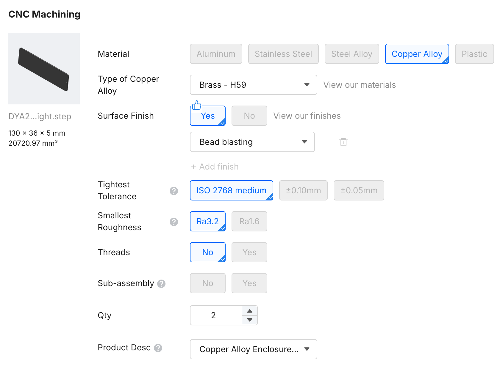

DYA2 にはいくつかのカスタマイズオプションがあります。

## 真鍮製エンブレムプレート

ボトムケースのエンブレムプレートを 3D プリント製から真鍮製に変更できます。真鍮プレートにすることで重量が増し、タイピング時の安定性が向上します。

真鍮プレートはご自身で [JLCCNC](https://jlccnc.com/) 等のCNC加工サービスに発注していただく形になります。データは [GitHub リポジトリ](https://github.com/cormoran/dya2-keyboard/tree/main/hardware/dya-v2-case) で公開している "For CNC" の step ファイルをご利用いただけます。
以下は JLCCNC での発注例です。

:::note
非常におすすめしたいカスタマイズのため、今後ご自身で発注いただくよりも安価な価格で提供できそうな目処がたった場合は販売する可能性があります。
:::

## Tadpole ピンの硬さ調整

Tadpole ピンには複数の硬さのバリエーションがあります。ご自身で入手することで、スイッチの底打ち感（タイピングの硬さ）を好みに合わせて調整できます。

同梱しているピンクの Tadpole ピンは標準的な硬さのものになります。配布時期や在庫状況によっては別の硬さのものが同梱されている可能性があります。

一部の硬さは [Booth](https://cormoran707.booth.pm) でも販売予定です。

## レジン製ケース

:::note
2026/02/24現在 レジン向けのケースデータはまだ公開していません。公開されているデータはヒートインサートナットを使うことを想定したPLA向けのみになります。
:::

JLC3DPなどにケースデータをご自身で発注することで、透明ケースやスプレーペイントされたケースを作ることができます。

ただし、レジンはねじ穴が弱くなりやすいため、ねじ止め部分に e-サートを取り付けることが推奨されます。ボトムケースに薄い部分があるため e-サートの取り付けは少し難易度が高いです。

## 今後の予定

- **パームレスト**: いい感じのものを作りたい
- **テンティング台**: 少しテンティングするとトラックボールがより使いやすくなりそうです
- **アルミ製トップケース**: 展示用に検討中
- **アルミ製ボトムケース**: 電池カバー部分で CNC 向けの設計変更が必要な状況

github に 2D の DFX ファイルも公開しているので 3D プリンタをお持ちの方はご自分でパームレストやテンティングプレートを設計していただくこともできると思います。
追加で必要な設計データがあれば相談ください。
