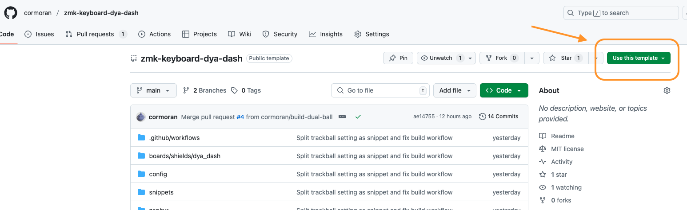
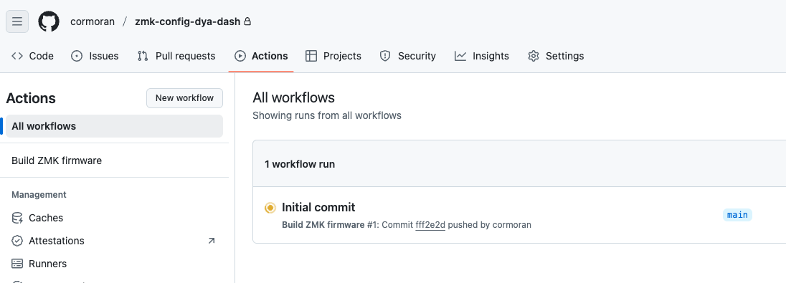
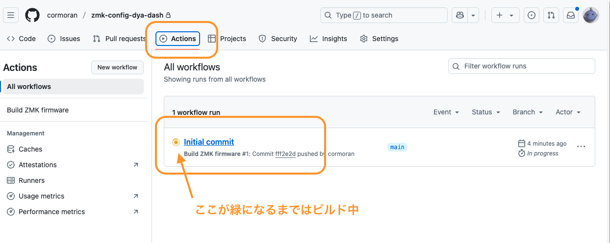
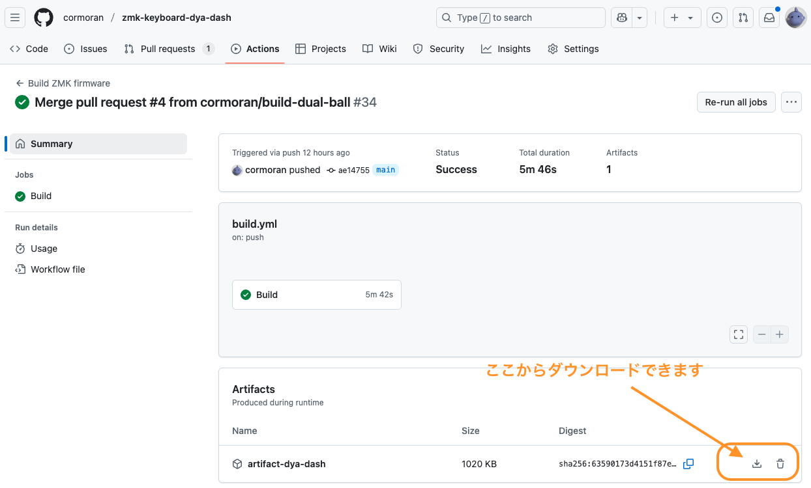
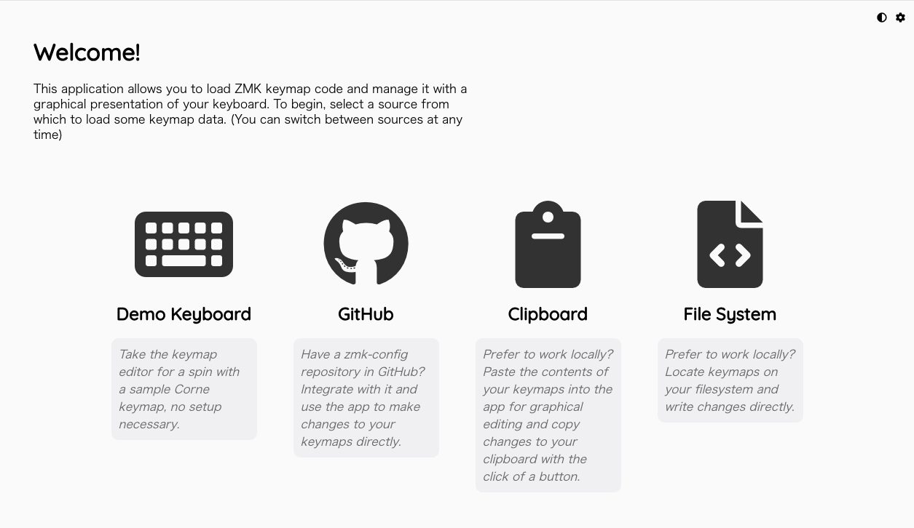
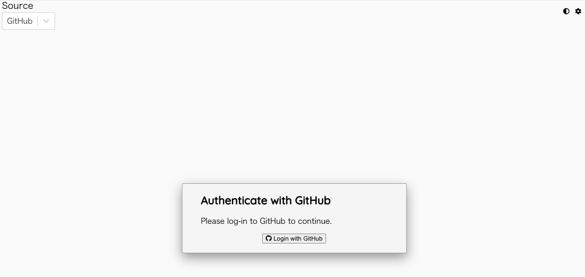
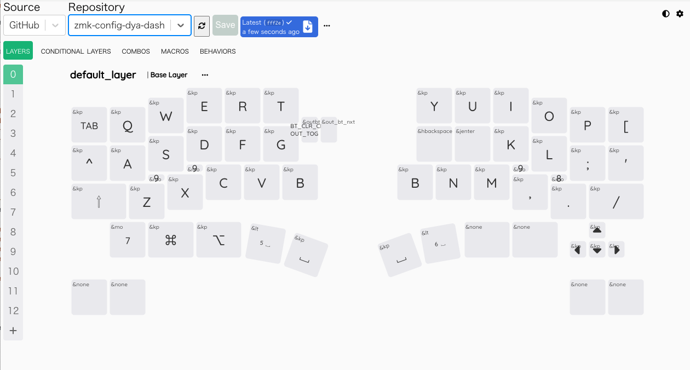

DYA2 のキーマップを変更する方法を解説したページです。
自由度と難易度の違う３つの方法があります。

1. **DYA Studio**: 最も簡単にさまざまな設定ができます。一部複雑なカスタマイズはできませんが今後機能を追加予定です。
   - **ZMK Studio**: ZMK 公式のキーマップカスタマイズツールです。最新機能が使える可能性がありますが、基本的には DYA Studio で同等以上の機能が提供されています。
2. **keymap editor**: Github レポジトリを作る必要がありますが、プログラミングなしで ZMK Studio よりも複雑なカスタマイズができます。
3. **プログラミング**: プログラミングの知識が必要ですが自由自在にカスタマイズができます。

## 1. DYA Studio を使ったカスタマイズ

ZMK Studio と同等のキーマッピング変更に加えて、トラックボールの調整などがファームウェア書き換えなしに行えます。

https://studio.dya.cormoran.works/ からアクセスできます。

### USB 接続でアクセスする方法

WebSerial に対応したブラウザで利用できます。モバイルOSでは利用できません。

1. PC とキーボード右手の外側の USB ポートを接続
2. https://studio.dya.cormoran.works/ にアクセスして USB マークの接続ボタンを選択
3. DYA2 を選択して接続
4. Fn+Caps (Fn:右下の一つ上, Caps: 左下)で `&studio unlock` を実行

※2024/02/24 現在一部の機能は左右を有線接続した状態では正常に動作しません。左右は無線接続にした状態でご利用ください。必要な実装していないだけなので今後対応予定です。

### 無線接続でアクセスする方法

Web Bluetooth に対応したブラウザで利用できます。iOS の場合は Bluefy というブラウザアプリから接続できます。Android は未検証です。

1. キーボードの USB ケーブルを外すか、無線接続優先モードに変更
2. Fn+Caps (Fn:右下の一つ上, Caps: 左下)で `&studio unlock` を実行
   - これを先にやらないと次のステップでデバイスが見つかりません
3. https://studio.dya.cormoran.works/ にアクセスして BLE マークの接続ボタンを選択
4. DYA2 を選択して接続
   - iOS の場合は現在周りにあるすべての BLE デバイスが表示されます。たくさんの無線機器に囲まれて暮らしている方はがんばって DYA2 を探してください。（今後できれば改善予定）

### 参考: ZMK Studio を使ったカスタマイズ

基本的には DYA Studio と同じように利用できます。以下の２種類の方法があります。

- ブラウザ上で動く公式サイト https://zmk.studio/ (USB 接続時のみ対応)
- PC アプリ https://zmk.studio/download (無線接続時も対応)

## 2. keymap editor を使ったカスタマイズ

ファームウェアのソースコードを自動で書き換えてくれるノーコードツール https://nickcoutsos.github.io/keymap-editor/ を使ったカスタマイズ方法です。
ZMK Studio ではできないマクロなどの高度なカスタマイズができます。

:::note[注意]
以下の内容は DYA2 のレポジトリではまだ検証できていません。
:::

### 設定レポジトリを Github に準備する

1. https://github.com/ のアカウントを作ります。
2. https://github.com/cormoran/zmk-keyboard-dya2 をテンプレートとして設定レポジトリを作ります。
   以下の画像は DYA Dash の使い回しです。

   

3. 自動的にファームウェアのビルドが始まることを確認します。
   - 作成されたレポジトリの "Actions" タブをクリックすると "Initial commit" という workflow が動いていると思います。
   - ビルドが終わるとその workflow の Summary ページの Artifacts に zip 圧縮されたファームウェア一式をダウンロードできるリンクが出現します。

   
   
   

### keymap editor で設定を編集

1.  https://nickcoutsos.github.io/keymap-editor/ を開いて、github アカウントと連携します。

    | GitHub を選択                 | Login with GitHub             |
    | ----------------------------- | ----------------------------- |
    |  |  |

    | Add Repository                | All repository か、上で作成したレポジトリを個別に選ぶ |
    | ----------------------------- | ----------------------------------------------------- |
    |  |                          |

2.  keymap editor で 2 で作ったレポジトリを選択して各種設置をカスタマイズして Save します
    - カスタマイズの方法などはネットで調べてください。https://sensai-gadget.com/keymap-editor-usage/ などは情報が多そうです。

    

3.  github のレポジトリに戻ると新しい変更が増えていてファームウェアのビルドが始まっています
4.  ビルドが完了したら Actions の Summary からファームウェアの zip をダウンロードして、キーボードにファームウェアを書き込みます。

## 3. プログラミングによるカスタマイズ

keymap editor を使ったカスタマイズの "設定レポジトリを Github に準備する" に従ってレポジトリ作ります。
あとはレポジトリの readme などを見ながらがんばってください。

main ブランチに push するとビルドが始まるほか、ビルドツールをインストールすればローカルでビルドもできるようになっています。
