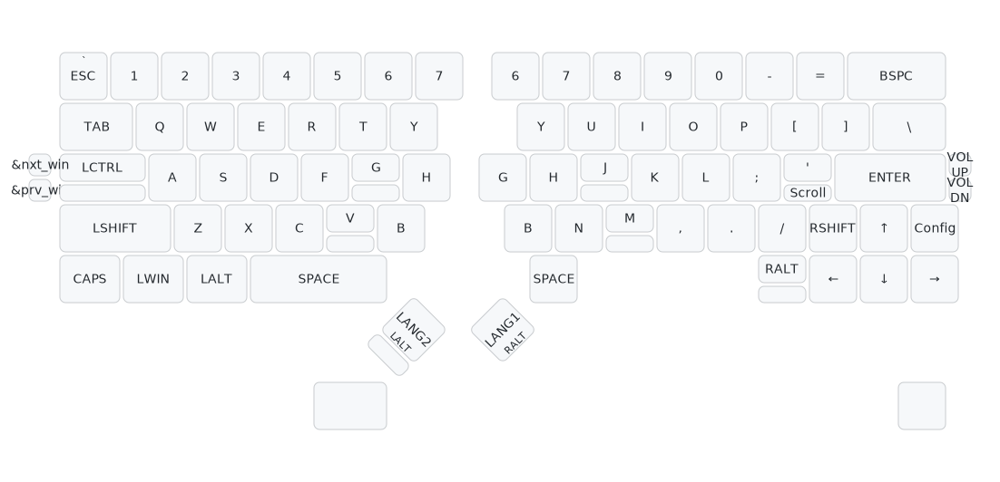
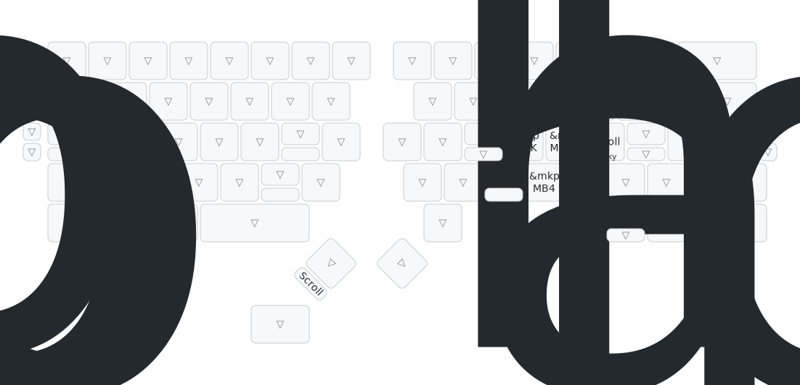

最新のキーマップは [Github の自動生成画像](https://github.com/cormoran/zmk-keyboard-dya2?tab=readme-ov-file#default-keymap) か DYA Studio の UI をご覧ください。

主要なレイヤーのデフォルトのキーマップについて解説します。
すべての割り当ては DYA Studio から編集が可能です。

## Base レイヤー

常にアクティブなレイヤーです。他のレイヤーにキーが設定されていない(`&trans`が設定されている)場合このレイヤーのキーマップが動作します。

#### キーの対応関係

- 縦に分割されている部分は上側がキーを押した時、下がタッチセンサーに触れた時のキーマップです。
- 左右に２つずつある小さなキーは設定キーです。
- 一番下の段の２つのキーは JIS レイアウト時に使うキーで、USレイアウトの場合は使われないので下に表示しています。

## マウスレイヤー

トラックボールを動かすとマウスレイヤーが自動的に有効になります。

#### マウスキー

- `M` キーで左クリック
- `K` キーでミドルクリック
- `L` キーで右クリック
- `,(<)` キーで戻る
- `.(>)` キーで進む

#### タッチセンサーの動作

- 右手小指をずらして `'` でスクロールモード
- `M` に指を置いている間マウスレイヤーモードが維持（されるはずですが少し不安定...）
- 左手の人差し指を右・下にずらして
  - `G` で低速モード
  - `V` で高速モード
- 左手親指部分でもスクロールモード

#### 設定の調整

マウスやスクロールの速度、自動でマウスレイヤーを有効にしない設定など細かな調整は DYA Studio から行えます。

## Config レイヤー

右下から一つ上のキーを押すと Config レイヤーが有効になります。 Config レイヤーは Function キーの他に接続先の設定などのマッピングを設定しています。

- `Q`~`T` BLE, USB 接続先の切り替え
- 左右の `&bootloader` を押すとファームウェア書き込みモードになります。外側のUSBポートでPCと接続した状態で押すことで、 XIAO のリセットボタンをダブルクリックしたのと同じ状態になります。
- 左下の `&studio unlock` は DYA Studio, ZMK Studio に接続した際にキーマップなどのセキュリティが必要な機能を有効化するためのキーです。
  - DYA Studio に無線接続するために、このキーを押すと BLE Advertize が開始されるようにもなっています。

## その他のレイヤー

Win, Mac, iOS, Linux レイヤーは [接続先ごとにキーマップを変える](/dya2-keyboard/feature-guide/default_layer_per_connection) 機能で使用することを想定したレイヤーです。

Scroll レイヤーはトラックボールをスクロール動作にするために使用するレイヤーです。基本的にはマッピングを定義していませんが、スクロール中のみに必要なマッピングを追加することもできます。
