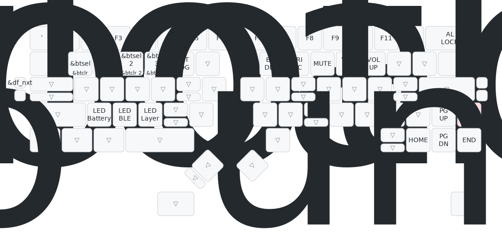

Windows PC と Mac や iPad など複数の OS とペアリングしている場合、OS ごとに必要なキーマップが違っていて困ります。

DYA2 には、接続先（BLE1, 2, 3, 4, USB）ごとにデフォルトレイヤーを切り替える機能が実装されています。

:::note

この機能は接続先の PC を識別してるわけではありません。例えば、USB を他の PC に差し替えるような場合は接続先ごとの切り替えはできません。

:::

Config(以下の赤いキー) + `df nxt`（左の設定ボタン上） を押すたびに、現在選択されている接続先のデフォルトレイヤーが 0 → 1 → 2 → 3 → 4 → 0 と切り替わり、レイヤーに対応する LED が点灯します。

### LED の意味

LED は左上から レイヤー0, 1, 2, 3 右上から 4, 5, 6, 7 に対応しています。

それぞれの LED は対応するレイヤーがアクティブなときに点灯します。接続先ごとに切り替えることができるのはレイヤー0~4の5つです。

- レイヤー 1~4 は接続先ごとに切り替えることができるレイヤーで、デフォルトでは以下のようにOSごとに割り当てる想定でキーマップとLEDの色を設定しています。 `df nxt` を押すたびに、LED が以下の順番で切り替わります。
  - 🔵 Layer1: Windows 空色
  - 🔴 Layer2: Mac 赤色
  - ⚪️ Layer3: iOS 白色
  - 🟠 Layer4: Linux オレンジ
- レイヤー0 はベースレイヤーで常にアクティブになるので、左の一つ目の LED は常に点灯します。Layer1~4 のどれも点灯していない状態は、接続先にレイヤー0が割り当てられている状態になります。
- レイヤー7 は Config レイヤーで、左手左下キーを押している間アクティブになるので、右の一番下の LED は赤いキーを押している間常に点灯します。
- レイヤー5,6 はマウスレイヤーで、トラックボール操作中の場合点灯します。

なお、Config + `C` キーで現在アクティブなレイヤーを確認することもできます。
例えば、Config + `C`を押した状態でトラックボールを動かすと右の上から３つ目のLEDが点灯するはずです。

なお、上の1~4のマッピングはあくまでおすすめとして設定してだけなので、レイヤーの使い方は自由です。

以下の動画は姉妹品の DYA Dash で接続先ごとにレイヤーが切り替わる様子を撮影したものです。DYA2 も同様の動作になります。

import { YouTube } from "astro-embed";

<YouTube id="PggxfXZUtnA" posterQuality="high" />
